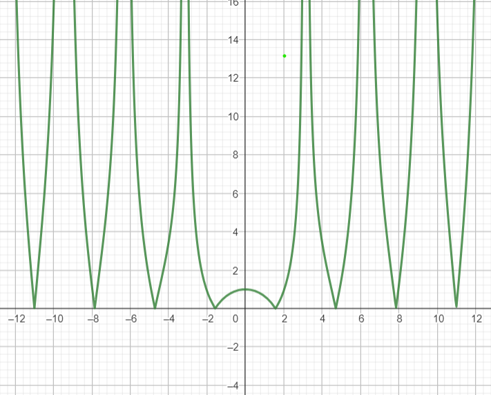

Łukasz Kluza, 05.03.2024
„Laboratorium” 01

## Arytmetyka Komputerowa

#### Treści zadań 

**_Zadanie 1._**
Znaleźć _"maszynowe epsilon"_, czyli najmniejszą liczbę _a_, taką że _a_+1>1

**_Zadanie 2._**

Rozważamy problem ewaluacji funkcji _sin(x)_, m.in. propagację błędu danych wejściowych, tj. błąd wartości funkcji ze względu na zakłócenie h w argumencie x:

- Ocenić błąd bezwzględny przy ewaluacji _sin(x)_

- Ocenić błąd względny przy ewaluacji _sin(x)_
  
- Ocenić uwarunkowanie dla tego problemu

- Dla jakich wartości argumentu x problem jest bardzo czuły ?

**_Zadanie 3._**

Funkcja sinus zadana jest nieskończonym ciągiem

\(
    sin(x) = x - \frac{x^3}{3!} + \frac{x^5}{5!} - \frac{x^7}{7!} + \dots
\)

- Jakie są błędy progresywny i wsteczny jeśli przybliżamy funkcję sinus biorąc tylko pierwszy człon rozwinięcią, tj. \(sin(x) \approx x\), dla x = 0.1, 0.5 i 1.0 ?

- Jakie są błędy progresywny i wsteczny jeśli przybliżamy funkcję sinus biorąc pierwsze dwa człony rozwinięcią, tj. \(sin(x) \approx x - \frac{x^3}{3!}\), dla x = 0.1, 0.5 i 1.0 ?

**_Zadanie 4._**

Zakładamy że mamy znormalizowany system zmiennoprzecinkowy z β = 10, p = 3, L = -98

- Jaka jest wartość poziomu UFL (underflow) dla takiego systemu ?

- Jeśli x = 6.87 x 10^(-97) i y = 6.81 x 10^(-97), jaki jest wynik operacji x – y ?

#### Rozwiązania

**_Zadanie 1._**
Aby wyznaczyć _maszynowe epsilon_ wystarczy zauważyć że musi on mieć taki sam wykładnik jak liczba \(1.0\) oraz jak najmniejszą mantysę, też równą \(1\). 

Dla typu _double_, który ma 53 bity na mantysę, możemy to oszacować na 
\(2^{-M}, (M  \rightarrow mantysa)\). Jednak, ponieważ w standardzie IEEE 754 pierwszy bit mantysy zawsze jest równy 1, więc w naszym przypadku _maszynowy epsilon_ wyniesie: \( \epsilon = 2^{-52},  (2^{1-M})\).


Dla przykładu w języku programowanie _python_ łatwo możemy sprawdzć ile wynosi _"maszynowe epsilon"_ użwyając wbudwoanych fuknkcji:
```python
print(sys.float_info.epsilon)
#2.220446049250313e-16
```
Lub możemy też zdefiniować własną funkcję:
```python
def show_info():
    number = 1.0
    ONE = 1.0
    while number + ONE > ONE:
        epsilon = number
        number /= 2

    print(f'Maszynowy epsilon: {epsilon}')

show_info()
# Maszynowy epsilon: 2.220446049250313e-16    
```

Jak widać powyższe wyniki uzyskane algebraicznie oraz numerycznie się pokrywają.

**_Zadanie 2._**

- Błąd względny
\(
\Delta f(x) =  \lvert sin(x) \cdot (1+\epsilon) - sin(x)\rvert
\)
<br>
- Błąd bezwzględny 
\(
\frac{\Delta f(x)}{x} = \lvert \frac{sin(x) \cdot (1+\epsilon) - sin(x)}{x} \rvert
\)
<br>
- Uwarunkowanie i czułość 
  \(cond \approx \lvert \frac{x \cdot f'(x)}{f(x)} \rvert = \lvert \frac{x \cdot cos(x)}{sin(x)} \rvert = \lvert x \cdot cot(x) \rvert \)

<p align="center">
  
</p>

Problem jest najlepiej uwarunkowany w miejscach kiedy funkcja \(y =  \lvert x \cdot cot(x) \rvert \) się zeruje, czyli \(x = \frac{\pi}{2} + k\pi, k \in \mathbb{Z} - \{0\} \).
Natomiast problen ten jest czuły (tj. najgorzej uwarunkowany), kiedy ta funkja ( \(y =  \lvert x \cdot cot(x) \rvert \) ) zmierza do nieskończoności, a wiec dla \(x = k\pi, k \in \mathbb{Z} - \{0\}\)

**_Zadanie 3._** 

Badanie własności funkcji _sin(x)_ wyprowadzonej za pomocą wzoru _Taylora_

\(
    sin(x) = x - \frac{x^3}{3!} + \frac{x^5}{5!} - \frac{x^7}{7!} + \dots
\)


__Wzory__:
y = f(x), gdzie \( f: \mathbb{R} \rightarrow \mathbb{R} \)
Błąd progresywny: \( \Delta y = |\hat{y} - y| \)
Błąd wsteczny: \( \Delta x = |\hat{x} - x| \)


- Błąd progresywny i wsteczny dla przybliżonego wzorem: _sin(x) ≈ x_ gdzie \(x = 0.1, 0.5, 1.0\).

\(y = sin(x)\)
\(\hat{y} = x, \hat{x} = arcsin(\hat{y})\)
Błąd progresywny: \( \Delta y = |\hat{y} - y| = |x-sin(x)| \)
Błąd wsteczny: \( \Delta x = |\hat{x} - x| = |arcsin(\hat{y})-x|  = |arcsin(x)-x| \)


| Wyniki/Dane | __\(\hat{y} = x\)__ | __\(\hat{x} = arcsin(\hat{y})\)__ | __\(sin(x)\)__ | Błąd progresywny | Błąd wsteczny |
| :---------: | :-----------------: | :-------------------------------: | :------------: | :--------------: | :-----------: |
|   _x=0.1_   |        _0.1_        |     \(arcsin(0.1)=0.1001674\)     |   0.0998334    |    0.0001666     |   0.0001674   |
|   _x=0.5_   |        _0.5_        |     \(arcsin(0.5)=0.5235987\)     |   0.4794255    |    0.0205745     |   0.0235987   |
|   _x=1.0_   |        _1.0_        |     \(arcsin(1.0)=1.5707963\)     |   0.8414709    |    0.1585291     |   0.5707963   |


- Błąd progresywny i wsteczny dla \(sin(x)\) przybliżonego wzorem: \(sin(x) \approx  x- \frac{x^3}{3!}\) gdzie \(x = 0.1, 0.5 , 1.0\).

\(y = sin(x)\)
\(\hat{y} = x- \frac{x^3}{3!}, \hat{x} = arcsin(\hat{y})\)
Błąd progresywny: \( \Delta y = |\hat{y} - y| = |( x- \frac{x^3}{3!})-sin(x)| \)
Błąd wsteczny: \( \Delta x = |\hat{x} - x| = |arcsin(\hat{y})-x| = |arcsin( x- \frac{x^3}{3!}) - x| \)


| Wyniki/Dane | __\(\hat{y} = x- \frac{x^3}{3!}\)__ | __\(\hat{x} = arcsin(\hat{y})\)__ | __\(sin(x)\)__ | Błąd progresywny | Błąd wsteczny |
| :---------: | :---------------------------------: | :-------------------------------: | :------------: | :--------------: | :-----------: |
|   _x=0.1_   |              0.0998333              |  \(arcsin(0.0998333)=0.0999998\)  |   0.0998334    |    0.0000001     |   0.0000002   |
|   _x=0.5_   |              0.4791666              |  \(arcsin(0.4791666)=0.4997049\)  |   0.4794255    |    0.0002589     |   0.0002951   |
|   _x=1.0_   |              0.8333333              |  \(arcsin(0.8333333)=0.9851107\)  |   0.8414709    |    0.0081376     |   0.0148893   |

**_Zadanie 4._** 

Dane: Znormalizowany system zmienno przecinowy z: \( \beta = 10, p = 3, L = -98 \)

- Underflow tego systemu: 
  
\(UFL = \beta ^ L\), czyli: \(UFL = 10^{-98}\) 
- Jaki jest wynik operacji \(x - y\), jeśli \(x = 6.87 \cdot 10^{-97}\) a \(y = 6.81 \cdot 10^{-97}\) 
  
\(x - y = 6.87 \cdot 10^{-97} - 6.81 \cdot 10^{-97} = 0.06 \cdot 10^{-98} = 6.0 \cdot 10^{-99} < 10^{-98}(UFL)\)

Ponieważ wartość takiej \(x-y\) jest mniejsza niż wartość _UFL_, więc wynik będzie równy _0_.

#### Wnioski
Analizując powyższe, bardzo łatwo można zauważyć, że w informatyce konieczne jest zachowanie szczególnej ostrożności podczas operacji na liczbach zmiennoprzecinkowych. Te liczby generują wiele problemów, zwłaszcza gdy są używane do reprezentowania bardzo małych wartości lub gdy odejmujemy od siebie dwie bardzo bliskie sobie liczby.

Jednym z głównych problemów jest utrata precyzji, która może wystąpić przy operacjach arytmetycznych na liczbach zmiennoprzecinkowych. Na przykład, gdy dodajemy do siebie bardzo małą wartość do bardzo dużej, wynik może być zaokrąglany do wartości większej niż oczekiwano, co prowadzi do błędnego wyniku.

Aby uniknąć tych problemów, należy brać pod uwagę kilka kwestii:

- _Unikanie operacji na liczbach o zbliżonych wartościach:_ W miarę możliwości, należy unikać odejmowania dwóch bardzo bliskich siebie liczb zmiennoprzecinkowych, ponieważ może to prowadzić do utraty precyzji.

- _Używanie większej precyzji:_ W niektórych przypadkach, zwłaszcza gdy operujemy na bardzo małych lub bardzo dużych wartościach, korzystanie z większej precyzji zmiennoprzecinkowej może pomóc uniknąć problemów związanych z utratą precyzji.

Dbanie o te kwestie pomoże nam uniknąc wielu problemów związanych z operacjami na liczbach zmiennoprzecinkowych i zapewni dokładnejsze i wiarygodniejsze wyniki obliczeń.

#### Biografia: 
- https://pl.wikipedia.org/wiki/IEEE_754
- Prof. Michael T. Heath, Scientific Computing: An Introductory SurveyChapter 1 – Scientific Computing
- dr. inż. Katarzyna Rycerz, Metody Obliczeniowe w Nauce i Technice - wykład 


